<p align="center">
  
</p>

<p align="center">
  <strong>A modular fixed-wing UAV flight-simulation portfolio project built in Unity 6.3 LTS and C#.</strong><br/>
  Physics-driven control, telemetry, camera systems and mission logic are developed as separate, explainable components.
</p>

<p align="center">
  <code>Unity 6.3 LTS</code> · <code>C#</code> · <code>URP</code> · <code>Unity Input System</code> · <code>Rigidbody Physics</code> · <code>Windows</code>
</p>

---

## 01 / PROJECT STATUS

**Current phase:** `Phase 05 — Engine & Throttle System`

| System | Status |
| --- | --- |
| Project architecture & technical documentation | ✅ Complete |
| Unity project setup | ✅ Complete |
| Test airfield & base environment | ✅ Complete |
| Aircraft model & physics root integration | ✅ Complete |
| Input system | ✅ Complete |
| Engine & throttle | 🔄 Next / in development |
| Core flight physics | ⏳ Planned |
| Ground handling & takeoff | ⏳ Planned |
| Camera systems | ⏳ Planned |
| Telemetry | ⏳ Planned |
| Mission & waypoint systems | ⏳ Planned |
| Ground-control UI | ⏳ Planned |
| Windows build | ⏳ Planned |

### Completed foundation

- Unity 6.3 LTS project with Universal Render Pipeline
- Modular `Assets/_Project` structure
- Dedicated `FlightTest` scene
- Airfield/base test environment
- Fixed-wing UAV visual model with a separate `Rigidbody` physics root
- Body, wing and landing-gear collider setup
- Gravity and runway-contact validation in Play Mode
- Unity Input System with separate `Aircraft`, `Camera` and `UI` action maps
- `AircraftInputReader` decoupled from flight physics
- Keyboard and DualSense gamepad input validation
- Development debug panel for live input values
- Clean Play Mode test scene without critical Console errors

---

## 02 / PROJECT GOAL

The goal is to build a complete single-player desktop mission loop around a fixed-wing UAV:

`pre-flight → takeoff → waypoint navigation → EO observation → mission objective → return → landing`

The project is intentionally developed **system by system instead of relying on a prepackaged flight framework**. The emphasis is not on military-grade aerodynamic fidelity; it is on creating a technically clear, maintainable and demonstrable simulation architecture.

### MVP target

The first complete version is planned to include:

- One fixed-wing UAV
- One airfield / test environment
- Keyboard, mouse and gamepad input
- Physics-based takeoff, flight and landing
- Follow camera and EO observation camera
- Basic telemetry interface
- A mission containing at least three waypoints
- Mission-complete flow
- Windows executable build

---

## 03 / ARCHITECTURE

The simulator avoids a single monolithic aircraft controller. Responsibilities are separated into small components that can be tested and evolved independently.

```text
AircraftInputReader
        │
        ├──► AircraftEngine
        ├──► AircraftPhysics
        ├──► AircraftControlSurfaces
        └──► AircraftGroundController
                    │
                    ├──► AircraftTelemetry
                    ├──► CameraModeController
                    ├──► MissionManager
                    └──► GroundControlUI
```

Planned core components:

| Component | Responsibility |
| --- | --- |
| `AircraftInputReader` | Reads and exposes user input independently from physics |
| `AircraftEngine` | Throttle state, thrust generation and engine parameters |
| `AircraftPhysics` | Airspeed, lift, drag and rotational control forces |
| `AircraftControlSurfaces` | Pitch, roll and yaw control behavior |
| `AircraftGroundController` | Runway steering, braking and ground state |
| `AircraftTelemetry` | Speed, altitude, attitude, heading and mission data |
| `CameraModeController` | Follow, body, free and EO camera modes |
| `MissionManager` | Mission state, objectives and completion conditions |
| `Waypoint` | Ordered mission navigation points |
| `GroundControlUI` | Telemetry and mission presentation |

### Engineering principles

- Input reading is separated from physics application.
- The visual model and physics root are independent objects.
- Physics work runs through the fixed-timestep simulation path.
- Inspector configuration uses serialized private fields where practical.
- Larger features are developed in isolated Git branches.
- Technical decisions are documented with their reasoning.
- Systems are designed to be explainable in a technical review.

For the reasoning behind individual choices, see [`TECHNICAL_DECISIONS.md`](TECHNICAL_DECISIONS.md).

---

## 04 / CONTROLS

Input is defined through Unity Input System. The physics layer does not read keyboard or gamepad state directly; it consumes values exposed by `AircraftInputReader`.

| Action | Keyboard / Mouse | Gamepad |
| --- | --- | --- |
| Pitch | `W / S` | Left Stick Y |
| Roll | `A / D` | Left Stick X |
| Yaw | `Q / E` | `L1 / R1` |
| Increase throttle | `Left Shift` | `R2` |
| Decrease throttle | `Left Control` | `L2` |
| Brake | `Space` | Cross / South Button |
| Change camera | `C` | Triangle / North Button |
| EO camera zoom | Mouse Wheel | D-Pad Up / Down |
| Pause | `Escape` | Options / Start |

DualSense controls have been validated in Play Mode through generic `Gamepad` bindings. Dedicated joystick / HOTAS support is intentionally postponed until after the MVP.

---

## 05 / TECH STACK

| Area | Technology |
| --- | --- |
| Engine | Unity 6.3 LTS — `6000.3.20f1` |
| Language | C# |
| Rendering | Universal Render Pipeline |
| Input | Unity Input System |
| Physics | Rigidbody-based Unity Physics |
| UI | uGUI + TextMeshPro |
| Version control | Git + GitHub |
| Target platform | Windows desktop |

### Technical direction

- Linear color space
- Semi-realistic, Rigidbody-based flight model
- Custom flight mechanics rather than a ready-made aircraft controller
- 16:9 desktop presentation
- Stable 60 FPS target on a mid-range PC
- Cinemachine deferred unless it provides clear value during the camera phase

---

## 06 / ROADMAP

- [x] Define project scope and MVP
- [x] Create technical documentation
- [x] Set up Unity project and repository structure
- [x] Build the test airfield / base environment
- [x] Integrate UAV model and physics root
- [x] Build the input layer
- [ ] Implement engine and throttle system
- [ ] Implement core flight physics
- [ ] Implement ground handling, takeoff and landing
- [ ] Build camera modes
- [ ] Build telemetry layer
- [ ] Build ground-control interface
- [ ] Add waypoint and mission flow
- [ ] Add EO observation / targeting interaction
- [ ] Audio and visual polish
- [ ] Optimization and multi-frame-rate validation
- [ ] Produce Windows build
- [ ] Record portfolio demonstration video

The detailed phase-by-phase tracker is maintained in [`TASKS.md`](TASKS.md).

---

## 07 / PROJECT STRUCTURE

```text
Assets/
├── _Project/
│   ├── Art/
│   ├── Audio/
│   ├── Prefabs/
│   │   └── Aircraft/
│   ├── Scenes/
│   ├── Scripts/
│   │   ├── Aircraft/
│   │   ├── Camera/
│   │   ├── Core/
│   │   ├── Input/
│   │   ├── Mission/
│   │   ├── Telemetry/
│   │   └── UI/
│   ├── Settings/
│   └── Tests/
└── ThirdParty/
```

Project-authored assets and systems are kept under `Assets/_Project` wherever possible. External packages and assets are isolated under `Assets/ThirdParty` so project code and third-party content remain easy to distinguish.

---

## 08 / DEVELOPMENT SETUP

Use **Unity 6.3 LTS — `6000.3.20f1`**.

```bash
git clone https://github.com/Flonq/uav-flight-simulator.git
```

### Third-party environment requirement

The **Military Base Pack** used by the `FlightTest` environment is intentionally **not distributed with this repository** because its license does not permit redistribution of the raw asset files.

To reproduce the full development scene, obtain the asset pack separately from its original source and place it at:

```text
Assets/ThirdParty/Tiny Teacup Studio/Military Base Pack/
```

The exact folder path is important because the Unity scene references the original asset GUIDs.

Then:

1. Open the repository from Unity Hub using `6000.3.20f1`.
2. Add the Military Base Pack to the path shown above.
3. Allow Unity to import packages and project assets.
4. Open `Assets/_Project/Scenes/FlightTest.unity`.
5. Confirm there are no critical Console errors.
6. Enter Play Mode to run the current test environment.

> A fresh clone without the Military Base Pack can still be used to inspect the project-authored code and architecture, but the full airfield environment will contain missing asset references until the pack is restored locally.

---

## 09 / DOCUMENTATION

| File | Purpose |
| --- | --- |
| [`PROJECT_OVERVIEW.md`](PROJECT_OVERVIEW.md) | Scope, goals, MVP and current state |
| [`TECHNICAL_DECISIONS.md`](TECHNICAL_DECISIONS.md) | Architectural decisions and reasoning |
| [`TASKS.md`](TASKS.md) | Detailed development phases and task tracking |
| [`README.md`](README.md) | Public project and portfolio overview |

---

## 10 / THIRD-PARTY CONTENT

Third-party content is kept separate from project-authored systems under `Assets/ThirdParty`.

### Military Base Pack

The test airfield and base environment use the **Military Base Pack** by Tiny Teacup Studio.

- The pack is used only as environment content.
- Its materials were adapted locally for URP.
- Raw asset files are not distributed through this public repository.
- Developers reproducing the full environment must obtain the pack separately and restore it to the expected local folder.

### UAV visual model

The UAV visual model was created specifically for this project and is project-owned content.

The model was adjusted for Unity scale, orientation and physics hierarchy, while all flight behavior is implemented independently from the visual asset.

Third-party content remains subject to its original license terms.

---

## 11 / SCOPE & DISCLAIMER

This repository is an **independent software-engineering and simulation portfolio project**. It is not a certified flight-training simulator and does not attempt to reproduce real UAV avionics, classified systems, operational data or military-grade aerodynamic models.

The project is not an official Baykar product and is not sponsored, endorsed or maintained by Baykar.

---

<p align="center">
  <strong>Mert Kaan Kindar</strong><br/>
  Software Engineer · Unity / Simulation Systems
</p>
